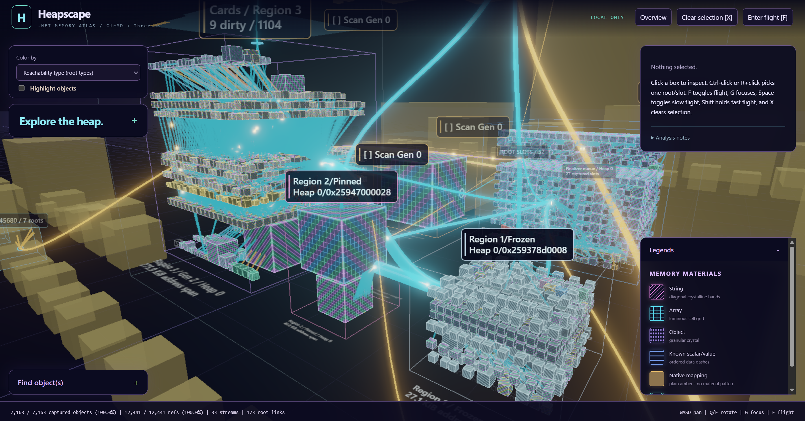
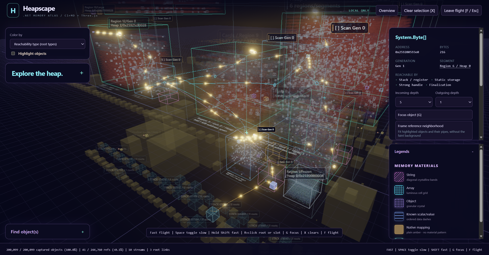
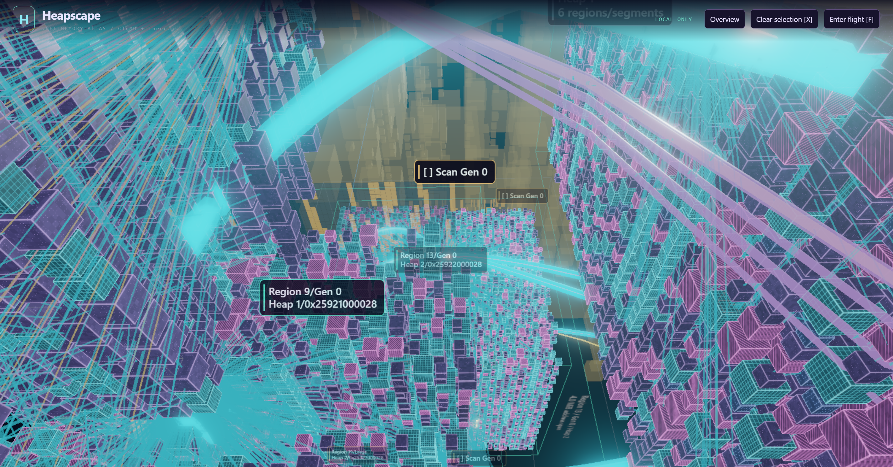

# Heapscape

A local, interactive 3D explorer for .NET memory dumps, built with **ClrMD**, **ASP.NET Core**, and **Three.js**. Fly through managed heaps, inspect objects and references, trace retaining routes, and explore GC roots, finalization queues, card tables, stacks, and native mappings.







## Requirements

- **Windows x64** with the **.NET 10 SDK**. `global.json` selects 10.0.100 or a later stable .NET 10 feature band.
- **Node.js 22.12+** on a supported release, including npm, and **PowerShell 7**.
- A **WebGL2-capable Edge or Chrome** browser. Browser tests use installed Microsoft Edge.
- Dumps require a matching local runtime/DAC, OS, and analyzer architecture. Cross-OS/architecture analysis is not supported; ELF mapping parsing alone does not imply end-to-end Linux support.

## Quick start

Run in PowerShell from the directory where you keep repositories:

```powershell
git clone https://github.com/kkokosa/heapspace.git
Set-Location .\heapspace
pwsh -File .\Start.ps1
```

Open **http://127.0.0.1:5077**. Stop with **Ctrl+C**. The launcher restores locked JavaScript dependencies when missing or mismatched, builds local frontend assets, restores the locked backend dependencies, and starts the server from its correct content root.

To run alongside another viewer:

```powershell
pwsh -File .\Start.ps1 -Port 5087
# Open http://127.0.0.1:5087
```

`-Port 0` chooses an unused loopback port; use the URL printed in `Now listening on`. Every server instance has its own temporary upload directory.

NuGet uses your normal configured sources, typically `https://api.nuget.org/v3/index.json`. If that endpoint fails, inspect the error and explicitly select an alternative:

```powershell
pwsh -File .\Start.ps1 -NuGetSource https://www.nuget.org/api/v2/
```

`Generate-Dumps.ps1` accepts the same override. There is no silent fallback, TLS bypass, or machine-wide configuration change.

To try the synthetic Console workload, follow the [source-only sample instructions](samples/README.md): build the existing fixture, collect a dump locally, and open it in Heapscape. No sample dumps or archives are distributed; even synthetic-process dumps may contain private data and must not be shared.

## Daily use

1. Choose **Open a memory dump**, optionally enable **Include strings**, and select a trusted full `.dmp` / `.core` dump (maximum **2 GiB**). Analysis runs in a cancellable worker.
2. Click an object or expand **Find object(s)** to search by type, exact address, or available preview. Inspect incoming/outgoing references, adjust their depths independently, or choose **Show all retaining routes**.
3. Use GC highlighting and per-card scan toggles to explore observed retention. Read **Analysis notes** for coverage and uncertainty; incomplete evidence is not proof that an object is unreachable.
4. Reopen or remove processed dumps in the dump dialog. Browser refresh preserves them while that server remains running; stopping the server does not preserve the saved-dump list.

Prism is the default theme. Physical GC grouping, bundled references, roots/native memory/cards/finalization, 5% selection context, and Very fast (3x) reference signals are always enabled. **Legends** describes memory materials only.

| Control | Action |
| --- | --- |
| Left drag / right drag / wheel | Orbit / pan / zoom |
| WASD, Q/E outside flight | Pan, rotate around the orbit target |
| F | Enter or leave flight |
| WASD, Q/E in flight | Move/strafe, move up/down |
| Space in flight | Toggle persistent slow/normal mode |
| Hold Shift in flight | Temporarily override either mode with fast movement |
| G / X | Focus / clear selection |
| Ctrl-click or R+click | Select a root or array slot through its container |
| Escape | Exit flight and clear selection; in the dump dialog, close only the dialog |

## Privacy and interpretation

The viewer binds only to loopback. Assets are bundled locally; it does not use a CDN, cloud uploads, telemetry, or symbol-server downloads. Initial dependency restoration needs access to package feeds.

**Analyze trusted dumps only.** ClrMD loads native DAC code; a separate worker provides crash containment and cancellation, **not a security sandbox**. Never expose the server to the network. Dumps and graphs may contain credentials and personal data even with string previews disabled.

Uploads and analyzed graphs are stored under the OS temporary `Heapscape` directory in a unique per-server subdirectory. Removing a processed dump or graceful shutdown deletes its files; forced termination can leave files behind. Deletion is not secure erasure. Original dump files are not modified.

Analysis captures all walkable objects, references, and roots without sampling caps; **display budgets only limit rendering**. Corrupt/unreadable data can still make a graph incomplete. Large graphs need substantial RAM/GPU memory; workers have a ten-minute timeout. Visual streams are static references, not measured traffic, and reachability is not a prediction of the next live GC.

Generated dumps, graphs, databases, logs, dependencies, and build output are ignored by Git. JSON is ignored by default except source manifests and lockfiles; explicitly review any new source-JSON exception. Ignore rules are a guardrail, not sanitization: review every file before publishing.

## Development and checks

From the repository root:

```powershell
npm ci
npm test
npm run build
dotnet build Server\Heapscape.csproj -c Release
dotnet run --project tests\Heapscape.Checks.csproj -c Release
npm run test:browser -- spatial.spec.js --grep "transparent boxes"
```

The Node tests and no-argument .NET checks use synthetic data. The selected WebGL test starts its own ephemeral HTTP server and needs no dump or running viewer.

**Dumps and analyzed fixture JSON are not included.** Install `dotnet-dump` separately if needed, then generate local synthetic workloads:

```powershell
dotnet tool install --global dotnet-dump  # Only if not already installed
pwsh -File .\Generate-Dumps.ps1 -Scenario Console
npm run test:jobs
```

`test:jobs` needs a Release backend and `artifacts\dumps\console.dmp`; it starts its own isolated server. Full browser suites additionally need the ASP.NET/Orchard dumps and exported graphs. For viewer tests, start a disposable server with `-Port 5087` in another terminal and set `$env:HEAPSCAPE_BASE_URL = 'http://127.0.0.1:5087'` before running `npm run test:browser -- viewer.spec.js`. Do not target a viewer holding useful uploads.

See the **[technical reference](docs/reference.md)** for complete fixture-generation/export commands, rendering and GC semantics, limitations, and upstream resources.

`Client` contains the Three.js viewer; `Server` contains the API, isolated analyzer, and native-map parser; `Fixtures` contains synthetic workloads; `tests` contains Node, .NET, and browser checks.

## Contributing and release status

Licensed under the [MIT License](LICENSE), copyright 2026 Konrad Kokosa. Third-party dependencies retain their own licenses.

See [CONTRIBUTING.md](CONTRIBUTING.md) for the CI checks and safe reproductions, [SECURITY.md](SECURITY.md) for security boundaries and private reporting, and the [public-release checklist](docs/public-release-checklist.md) for remaining owner decisions. Public release and any visibility change require separate approval.
